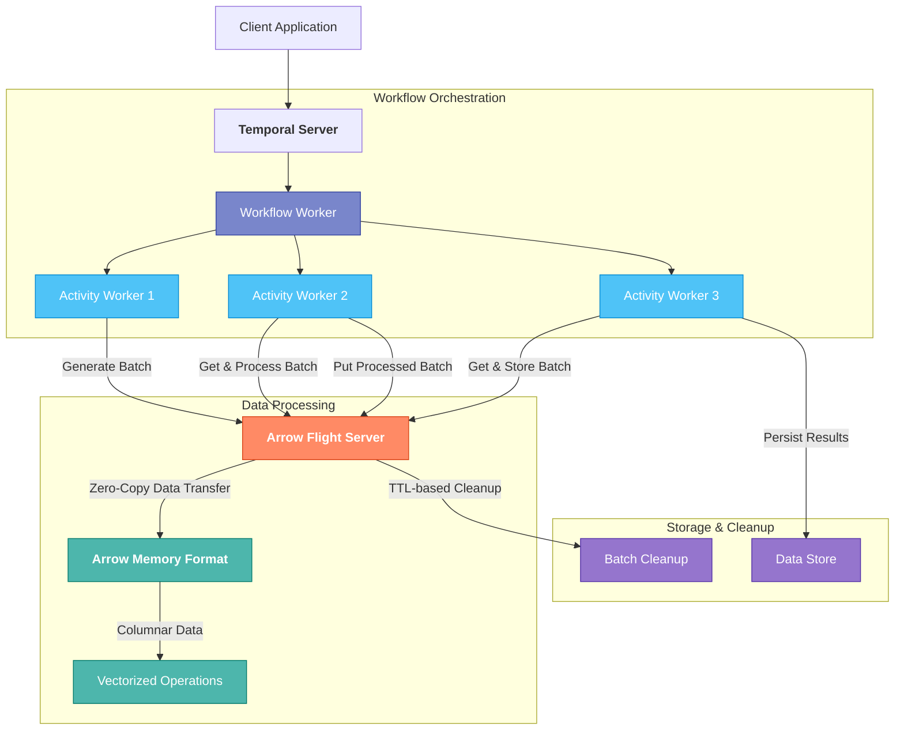

# Data Processing Pipeline with Temporal and Apache Arrow

A high-performance data processing pipeline using Temporal for workflow orchestration and Apache Arrow for efficient data handling.

## Features

- **Streaming Record Batch Processing**: Process data in batches for optimal throughput
- **Zero-Copy Operations**: Minimize memory overhead with Arrow's zero-copy operations
- **Vectorized Execution**: Leverage Arrow's columnar format for vectorized processing
- **Fault Tolerance**: Utilize Temporal's reliability features for resilient workflows
- **Memory Efficiency**: Optimize memory usage with Arrow's columnar data structures
- **Scalability**: Scale horizontally with Temporal workers
- **Arrow Flight Integration**: Direct memory sharing between activities using Arrow Flight

## Architecture

The pipeline consists of several key components:

### System Architecture Diagram



### Arrow Data Converter

Efficiently serializes and deserializes Arrow data structures for Temporal payloads.

### Arrow Flight Server

Enables direct memory sharing between activities, minimizing serialization overhead.

### Streaming Workflow

Orchestrates the data processing pipeline with Temporal, managing the flow of data between activities.

### Data Processing Activities

- **Generate Batch Activity**: Creates Arrow RecordBatches with sample data
- **Process Batch Activity**: Filters and transforms the data using vectorized operations
- **Store Batch Activity**: Stores the processed data (simulated in this example)

### Batch Processors

Implements vectorized operations on Arrow data for efficient processing.

### Command-line Interface

Provides a flexible interface for configuring and running the pipeline.

## Workflow Orchestration

```text
┌─────────────────┐     ┌─────────────────┐     ┌─────────────────┐
│  Generate Batch │────▶│  Process Batch  │────▶│   Store Batch   │
│    Activity     │     │    Activity     │     │    Activity     │
└─────────────────┘     └─────────────────┘     └─────────────────┘
        │                       │                       │
        ▼                       ▼                       ▼
┌─────────────────────────────────────────────────────────────────┐
│                       Arrow Flight Server                       │
└─────────────────────────────────────────────────────────────────┘
```

## Implementation Details

### Zero-Copy Operations with Arrow Flight

The pipeline uses Arrow Flight for direct memory sharing between activities:

```go
// Store a batch in the Flight server
batchID, err := flightClient.PutBatch(ctx, batch)

// Retrieve a batch from the Flight server
retrievedBatch, err := flightClient.GetBatch(ctx, batchID)
```

### Vectorized Processing

Arrow's columnar format enables efficient vectorized operations:

```go
// Filter rows based on a threshold
filteredBatch, err := arrow.FilterBatch(batch, threshold)
```

## Known Limitations

- **Schema Flexibility**: The current implementation uses a fixed schema
- **Memory Management**: Large datasets may require careful memory management
- **Error Handling**: Error recovery could be improved for production use
- **Data Type Support**: Limited to a subset of Arrow data types
- **Serialization Overhead**: Minimized but not eliminated with Arrow Flight
- **Temporal Payload Size Limits**: Bypassed with Arrow Flight for large datasets
- **Compute Utilization**: Could be further optimized with SIMD instructions
