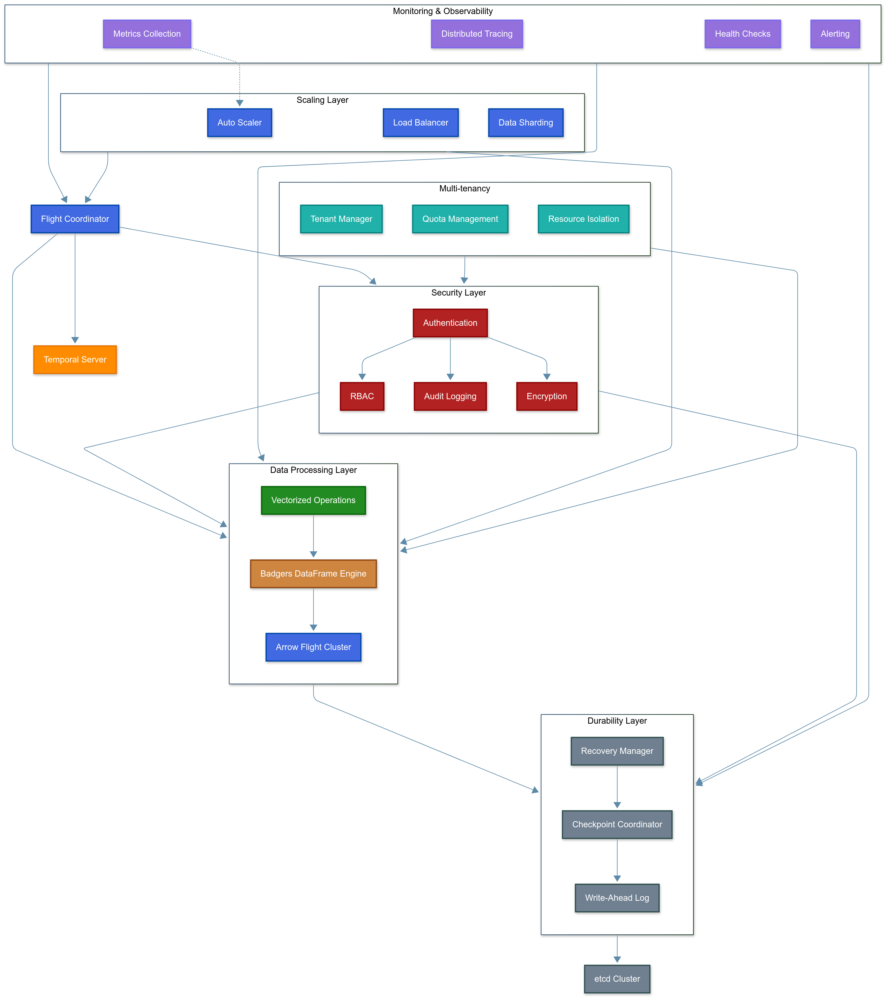

# Flight at Scale

*Exploring the Intersection of Temporal and Apache Arrow Flight*

I believe, deeply, that if we make data movement instantaneous, we change the world. Marginally faster row-based systems aren't enough. What we need is a fundamental shift in how we move and process data. That shift is Arrow.

## The Experiment Begins

Performance has always been the undercurrent. Year after year, I've seen talented data engineers fighting the same frustrating battles—slow ETLs bogged down by serialization overhead, endless memory inefficiencies, pipelines that felt more like compromises than solutions. But what if it didn't have to be this way?

This is my story of testing those limits—combining Temporal's powerful orchestration engine with Apache Arrow Flight's zero-copy data movement. It's not just about new tools or fancy tech demos. It's about stepping away from old assumptions and discovering what's possible when we rethink how data moves at scale.

## The Problem That Kept Me Up at Night

In my work with large-scale data pipelines, I've encountered a persistent challenge: the "double serialization problem." Here's what happens in a typical scenario:

1. Data is extracted from a source system
2. It's serialized into a format like JSON or Parquet
3. The serialized data is passed through a workflow engine
4. It's deserialized for processing
5. The results are serialized again
6. Finally, it's deserialized for storage

Each step adds latency. Each transformation consumes CPU cycles. Each serialization creates memory pressure. I knew there had to be a better way.

## A Glimpse of the Future

Apache Arrow Flight caught my attention because it promised something revolutionary: zero-copy data movement over the network. Instead of serializing and deserializing data at each step, Arrow Flight maintains data in its native columnar format throughout the pipeline.

But Arrow Flight alone wasn't enough. We needed a way to orchestrate these high-performance data movements, to handle failures gracefully, and to maintain state across distributed systems. That's where Temporal came in.

## The Architecture That Changed Everything

Here's how it all fits together:

What I've built is an experimental prototype that combines:

- **Temporal's Workflow Engine**: For robust orchestration and fault tolerance
- **Arrow Flight**: For zero-copy data movement
- **Columnar Processing**: For vectorized operations on the fly
- **Badgers DataFrame API**: A native Go implementation for high-performance data manipulation

The result is a system that can move and process data at near-hardware speeds while maintaining the reliability of a production-grade workflow engine.

## Why This Matters

The implications of this approach are profound:

1. **Memory Efficiency**: By keeping large data payloads outside the workflow state, we eliminate the memory pressure that typically plagues workflow engines.

2. **Zero-Copy Movement**: Data stays in its native columnar format throughout the pipeline, eliminating serialization overhead.

3. **Decoupled Scaling**: The orchestration layer can scale independently of the data movement layer.

4. **Resilience Without Compromise**: We get Temporal's workflow durability without sacrificing Arrow Flight's performance.

5. **Vectorized Processing**: The columnar format enables SIMD operations and near-hardware-speed processing.

6. **Language Agnostic**: The system can handle polyglot data pipelines with ease.

7. **Native Data Processing**: Badgers provides a Go-native DataFrame API for seamless integration.

## The Road Ahead

This is still an experimental prototype, but the results are promising.

The future of data processing isn't about bigger clusters or faster networks. It's about smarter architectures that eliminate unnecessary overhead. This prototype is just the beginning.

## The Journey to Enterprise Grade

The path from prototype to enterprise solution is ambitious but clear. I've mapped out six key phases that will transform this experimental system into a production-ready platform:

1. **Data Durability & Recovery**: Building a distributed checkpointing system to ensure zero data loss and sub-5-second recovery times.

2. **Enterprise Security**: Implementing end-to-end security with RBAC, encryption, and comprehensive audit logging.

3. **Observability & Monitoring**: Adding deep visibility with distributed tracing and real-time performance metrics.

4. **Scalability & Performance**: Enabling horizontal scaling with dynamic workers and intelligent load balancing.

5. **Enterprise Integration**: Supporting multi-tenancy, disaster recovery, and enterprise authentication.

6. **ETL & Data Processing**: Integrating with the [Badgers DataFrame API](https://github.com/TFMV/badgers) and other Arrow-compatible tools.

The target metrics are ambitious but achievable:

- Zero data loss during failures
- Recovery time under 5 seconds
- Latency under 100ms
- Throughput over 1M records/second
- 99.999% uptime

Here's our target state architecture:

For a detailed breakdown of each phase, implementation details, and technical specifications, see the [complete roadmap](roadmap.md).

## Join the Experiment

I'm actively working on this prototype and would love to collaborate with others who share this vision. The code is available on GitHub, and I'm documenting the journey as we push the boundaries of what's possible.

The future of data processing is here. It's columnar. It's zero-copy. It's orchestrated. And it's just getting started.

*This is an experimental prototype. Your feedback and contributions are welcome.*

---
*Thomas F McGeehan V is exploring the intersection of workflow orchestration and high-performance data processing. Follow his journey on [GitHub](https://github.com/TFMV).*
