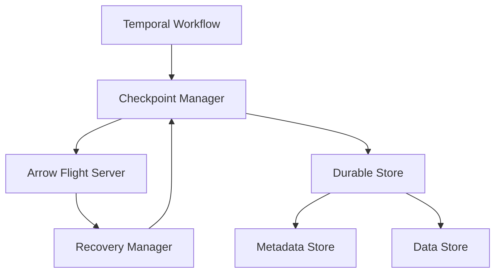

# Roadmap: Evolving Flight Orchestration to Enterprise Grade

## Current State Analysis

The current prototype demonstrates the power of combining Temporal's workflow engine with Arrow Flight's zero-copy data movement. However, several critical aspects need to be addressed for enterprise-grade deployment:

1. **Data Durability**: Data is currently managed outside Temporal's workflow state
2. **Error Handling**: Limited error recovery mechanisms
3. **Monitoring**: Basic observability capabilities
4. **Security**: No built-in security controls
5. **Scalability**: Basic scaling mechanisms

## Phase 1: Data Durability & Recovery

### 1.1 Implement Checkpointing System

- Design and implement a distributed checkpointing system
- Store Arrow Flight data references in a durable store
- Implement checkpoint metadata in Temporal workflow state
- Add checkpoint verification and validation

### 1.2 Data Lifecycle Management

- Implement TTL (Time-To-Live) policies for Arrow Flight data
- Add data cleanup mechanisms
- Implement data retention policies
- Add data versioning support

### 1.3 Recovery Mechanisms

- Implement automatic recovery from Arrow Flight server failures
- Add data reconstruction capabilities
- Implement partial failure recovery
- Add data consistency verification

## Phase 2: Enterprise Security

### 2.1 Authentication & Authorization

- Implement Arrow Flight authentication
- Add role-based access control (RBAC)
- Implement audit logging
- Add encryption at rest and in transit

### 2.2 Data Protection

- Implement data masking
- Add sensitive data detection
- Implement data lineage tracking
- Add compliance reporting

## Phase 3: Observability & Monitoring

### 3.1 Metrics & Monitoring

- Implement detailed performance metrics
- Add resource utilization tracking
- Implement cost tracking
- Add SLA monitoring

### 3.2 Logging & Tracing

- Implement distributed tracing
- Add structured logging
- Implement log aggregation
- Add alerting capabilities

## Phase 4: Scalability & Performance

### 4.1 Horizontal Scaling

- Implement dynamic worker scaling
- Add load balancing
- Implement data partitioning
- Add sharding support

### 4.2 Performance Optimization

- Implement caching layer
- Add query optimization
- Implement batch processing
- Add performance profiling

## Phase 5: Enterprise Integration

### 5.1 Enterprise Features

- Add multi-tenant support
- Implement resource quotas
- Add backup and restore
- Implement disaster recovery

### 5.2 Integration Capabilities

- Add enterprise authentication integration
- Implement enterprise monitoring integration
- Add enterprise storage integration
- Implement enterprise security integration

## Technical Implementation Details

### Data Durability Architecture



### Checkpointing System

```go
type Checkpoint struct {
    ID            string
    WorkflowID    string
    DataRef       string
    Metadata      map[string]interface{}
    Timestamp     time.Time
    Version       int
    State         CheckpointState
}

type CheckpointManager interface {
    CreateCheckpoint(ctx context.Context, data arrow.Record) (*Checkpoint, error)
    RestoreCheckpoint(ctx context.Context, checkpointID string) (arrow.Record, error)
    ValidateCheckpoint(ctx context.Context, checkpointID string) error
    CleanupCheckpoint(ctx context.Context, checkpointID string) error
}
```

### Recovery System

```go
type RecoveryManager interface {
    DetectFailure(ctx context.Context, checkpointID string) error
    RecoverData(ctx context.Context, checkpointID string) error
    VerifyConsistency(ctx context.Context, checkpointID string) error
    ReportStatus(ctx context.Context, checkpointID string) error
}
```

## Success Metrics

1. **Data Durability**
   - Zero data loss during failures
   - Recovery time < 5 seconds
   - Checkpoint overhead < 1% of processing time

2. **Security**
   - Zero security incidents
   - 100% audit trail coverage
   - Compliance with enterprise security standards

3. **Performance**
   - Latency < 100ms for data operations
   - Throughput > 1M records/second
   - Resource utilization < 80%

4. **Reliability**
   - 99.999% uptime
   - Zero data corruption
   - Automatic recovery from all failure scenarios
