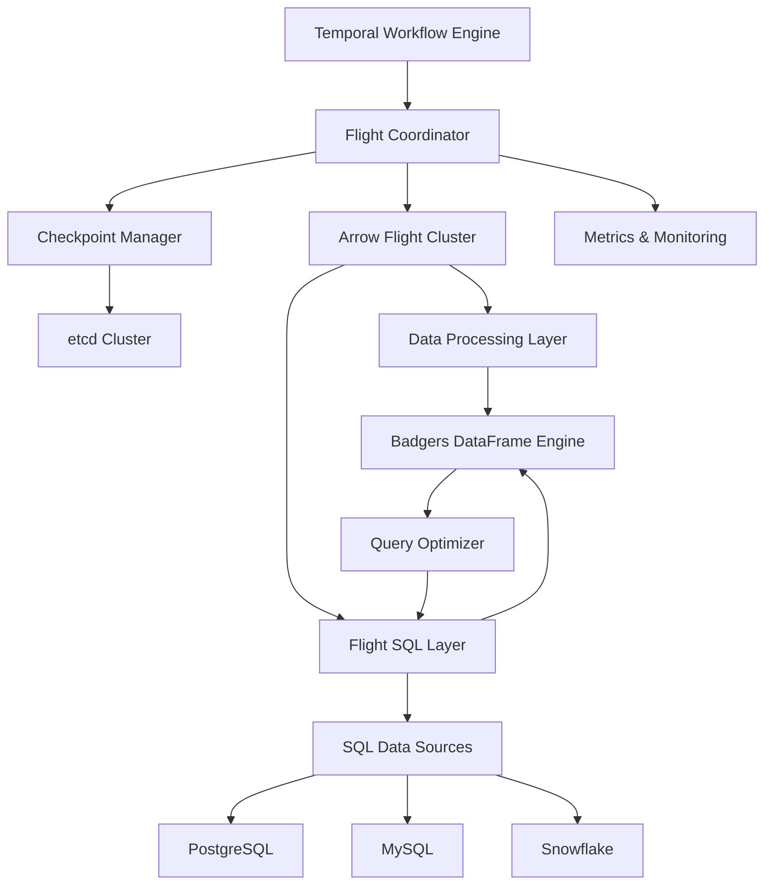

# Roadmap: Enterprise-Grade Flight Orchestration

## System Architecture Overview

The system is built on four core principles:

1. Zero-copy data movement
2. Distributed durability
3. Scalable orchestration
4. Universal SQL connectivity



## Current State Analysis

The current prototype demonstrates the power of combining Temporal's workflow engine with Arrow Flight's zero-copy data movement. However, several critical challenges need to be addressed:

1. **Data Durability Risk**: Data managed outside Temporal's workflow state lacks durability guarantees
   - Challenge: Data loss during Arrow Flight server failures
   - Challenge: Inconsistent state between Temporal workflows and Arrow Flight data
   - Challenge: No automatic recovery mechanisms
   - Challenge: SQL transaction consistency across distributed system

2. **Performance Bottlenecks**:
   - Challenge: Memory pressure during large data transfers
   - Challenge: Network congestion with multiple concurrent transfers
   - Challenge: CPU saturation during vectorized operations
   - Challenge: SQL query optimization and pushdown efficiency

3. **Security Gaps**:
   - Challenge: No end-to-end encryption for data in flight
   - Challenge: Lack of fine-grained access control
   - Challenge: Missing audit trails for data access
   - Challenge: SQL credential management and security

4. **Scalability Limitations**:
   - Challenge: Single Arrow Flight server becomes a bottleneck
   - Challenge: Resource contention between workflow and data operations
   - Challenge: No automatic scaling mechanisms
   - Challenge: SQL connection pooling and management

## Core Components

### Flight Coordinator

```go
type FlightCoordinator struct {
    // Core components
    temporalClient   temporal.Client
    checkpointer     *CheckpointCoordinator
    flightCluster    *FlightCluster
    metrics         *SystemMetrics

    // Flight SQL components
    sqlServer       *FlightSQLServer
    sqlCatalog      *SQLCatalog
    queryOptimizer  *QueryOptimizer

    // Security
    authProvider    auth.Provider
    encryptionKeys *keys.Manager
    credentialStore *SQLCredentialStore

    // Scaling
    autoScaler     *AutoScaler
    loadBalancer   *LoadBalancer
}

func (fc *FlightCoordinator) ProcessDataBatch(ctx context.Context, batch *DataBatch) error {
    // 1. Create checkpoint
    checkpoint, err := fc.checkpointer.CreateCheckpoint(ctx, batch)
    if err != nil {
        return fmt.Errorf("checkpoint creation failed: %w", err)
    }

    // 2. Optimize data movement strategy
    strategy, err := fc.queryOptimizer.OptimizeDataMovement(ctx, batch)
    if err != nil {
        return fmt.Errorf("optimization failed: %w", err)
    }

    // 3. Distribute data across Flight cluster
    flightRefs, err := fc.flightCluster.DistributeData(ctx, batch, strategy, checkpoint)
    if err != nil {
        return fmt.Errorf("data distribution failed: %w", err)
    }

    // 4. Update workflow state with references
    if err := fc.updateWorkflowState(ctx, flightRefs); err != nil {
        return fmt.Errorf("workflow state update failed: %w", err)
    }

    // 5. Monitor processing
    return fc.monitorProcessing(ctx, flightRefs)
}
```

### Flight SQL Integration

```go
type FlightSQLServer struct {
    // Core SQL components
    catalog     *SQLCatalog
    executor    *SQLExecutor
    optimizer   *QueryOptimizer
    
    // Connection management
    connPool    *ConnectionPool
    txManager   *TransactionManager
    
    // Security
    credStore   *CredentialStore
    authManager *AuthManager
}

type SQLCatalog struct {
    databases map[string]*DatabaseInfo
    schemas   map[string]*SchemaInfo
    tables    map[string]*TableInfo
    stats     *StatisticsCollector
}

type QueryOptimizer struct {
    // Optimization components
    stats        *Statistics
    costModel    *CostModel
    rules        []OptimizationRule
    
    // Flight-specific optimizations
    pushdown     *PushdownOptimizer
    vectorizer   *VectorizedOptimizer
}

func (s *FlightSQLServer) ExecuteQuery(ctx context.Context, query string) (*arrow.RecordBatch, error) {
    // 1. Parse and validate query
    plan, err := s.optimizer.OptimizeQuery(query)
    if err != nil {
        return nil, fmt.Errorf("query optimization failed: %w", err)
    }

    // 2. Apply pushdown optimizations
    if pushedPlan, ok := s.optimizer.pushdown.TryPushdown(plan); ok {
        plan = pushedPlan
    }

    // 3. Execute optimized query
    batch, err := s.executor.ExecutePlan(ctx, plan)
    if err != nil {
        return nil, fmt.Errorf("query execution failed: %w", err)
    }

    return batch, nil
}
```

## Phase 1: Data Durability & Recovery

### Unified Checkpointing System

```go
type CheckpointCoordinator struct {
    etcdClient    *clientv3.Client
    flightCluster *FlightCluster
    store         storage.Store
    metrics       *SystemMetrics
}

type Checkpoint struct {
    ID            string
    WorkflowID    string
    FlightRefs    []FlightDataRef
    Metadata      map[string]interface{}
    Version       int64
    State         CheckpointState
    CreatedAt     time.Time
}

func (cc *CheckpointCoordinator) CreateCheckpoint(ctx context.Context, data *arrow.Record) (*Checkpoint, error) {
    // 1. Begin distributed transaction
    tx, err := cc.store.BeginTx(ctx)
    if err != nil {
        return nil, fmt.Errorf("failed to begin transaction: %w", err)
    }
    defer tx.Rollback()

    // 2. Create checkpoint with versioning
    checkpoint := &Checkpoint{
        ID:         uuid.New().String(),
        WorkflowID: ctx.Value(WorkflowIDKey).(string),
        Version:    cc.nextVersion(),
        CreatedAt:  time.Now(),
    }

    // 3. Store data with references
    if err := cc.storeDataWithRefs(ctx, tx, checkpoint, data); err != nil {
        return nil, fmt.Errorf("failed to store data: %w", err)
    }

    // 4. Commit transaction
    if err := tx.Commit(); err != nil {
        return nil, fmt.Errorf("failed to commit transaction: %w", err)
    }

    return checkpoint, nil
}
```

### Recovery Protocol

```go
type RecoveryManager struct {
    coordinator  *CheckpointCoordinator
    consensus   *ConsensusManager
    metrics     *SystemMetrics
}

func (rm *RecoveryManager) RecoverFromFailure(ctx context.Context, failure *FailureEvent) error {
    // 1. Acquire distributed lock
    lock, err := rm.consensus.AcquireLock(ctx, failure.Region)
    if err != nil {
        return fmt.Errorf("failed to acquire lock: %w", err)
    }
    defer lock.Release()

    // 2. Load latest valid checkpoint
    checkpoint, err := rm.coordinator.GetLatestCheckpoint(ctx, failure.WorkflowID)
    if err != nil {
        return fmt.Errorf("failed to get checkpoint: %w", err)
    }

    // 3. Verify data integrity
    if err := rm.verifyDataIntegrity(ctx, checkpoint); err != nil {
        return fmt.Errorf("data integrity check failed: %w", err)
    }

    // 4. Rebuild state
    return rm.rebuildState(ctx, checkpoint)
}
```

### SQL Transaction Management

```go
type TransactionManager struct {
    coordinator *CheckpointCoordinator
    sqlCatalog  *SQLCatalog
    txTracker   *TransactionTracker
}

func (tm *TransactionManager) BeginDistributedTx(ctx context.Context) (*DistributedTx, error) {
    // 1. Create distributed transaction ID
    txID := uuid.New()
    
    // 2. Begin transaction in participating databases
    participants, err := tm.initializeParticipants(ctx, txID)
    if err != nil {
        return nil, fmt.Errorf("failed to initialize participants: %w", err)
    }
    
    // 3. Create transaction checkpoint
    if err := tm.coordinator.CreateTxCheckpoint(ctx, txID, participants); err != nil {
        return nil, fmt.Errorf("failed to create tx checkpoint: %w", err)
    }
    
    return &DistributedTx{ID: txID, Participants: participants}, nil
}
```

## Phase 2: Security & Access Control

### Unified Security Layer

```go
type SecurityManager struct {
    authProvider    auth.Provider
    encryptionKeys *keys.Manager
    policyEngine   *opa.Engine
    auditLogger    *AuditLogger
}

func (sm *SecurityManager) SecureFlightStream(ctx context.Context, stream *flight.DataStream) (*flight.DataStream, error) {
    // 1. Authenticate request
    identity, err := sm.authProvider.Authenticate(ctx)
    if err != nil {
        return nil, fmt.Errorf("authentication failed: %w", err)
    }

    // 2. Check authorization
    if err := sm.policyEngine.Evaluate(ctx, identity, stream.Action); err != nil {
        return nil, fmt.Errorf("authorization failed: %w", err)
    }

    // 3. Encrypt stream
    encryptedStream, err := sm.encryptStream(ctx, stream)
    if err != nil {
        return nil, fmt.Errorf("encryption failed: %w", err)
    }

    // 4. Log audit event
    sm.auditLogger.LogAccess(ctx, identity, stream.Action)

    return encryptedStream, nil
}
```

### SQL Security Integration

```go
type SQLSecurityManager struct {
    authProvider    auth.Provider
    credStore      *SQLCredentialStore
    policyEngine   *opa.Engine
    auditLogger    *AuditLogger
}

func (sm *SQLSecurityManager) SecureSQLConnection(ctx context.Context, dbConfig *DatabaseConfig) (*SecureConnection, error) {
    // 1. Authenticate request
    identity, err := sm.authProvider.Authenticate(ctx)
    if err != nil {
        return nil, fmt.Errorf("authentication failed: %w", err)
    }

    // 2. Retrieve and decrypt database credentials
    creds, err := sm.credStore.GetCredentials(ctx, dbConfig.Name, identity)
    if err != nil {
        return nil, fmt.Errorf("credential retrieval failed: %w", err)
    }

    // 3. Apply security policies
    if err := sm.policyEngine.EvaluateDBAccess(ctx, identity, dbConfig); err != nil {
        return nil, fmt.Errorf("policy evaluation failed: %w", err)
    }

    // 4. Establish secure connection
    conn, err := sm.establishSecureConnection(ctx, dbConfig, creds)
    if err != nil {
        return nil, fmt.Errorf("connection failed: %w", err)
    }

    // 5. Log audit event
    sm.auditLogger.LogDatabaseAccess(ctx, identity, dbConfig.Name)

    return conn, nil
}
```

## Phase 3: Observability & Monitoring

### 3.1 Distributed Tracing

- **Implementation**: OpenTelemetry integration with custom Arrow Flight instrumentation
- **Technical Solution**:

  ```go
  type TracedFlightServer struct {
      *flight.Server
      tracer trace.Tracer
      metrics *Metrics
  }

  func (s *TracedFlightServer) DoAction(ctx context.Context, action *flight.Action) (*flight.Result, error) {
      ctx, span := s.tracer.Start(ctx, "flight.action")
      defer span.End()
      // Add custom attributes and events
  }
  ```

### SQL Query Monitoring

```go
type SQLMetricsCollector struct {
    metrics    *Metrics
    tracer     trace.Tracer
    analyzer   *QueryAnalyzer
}

func (mc *SQLMetricsCollector) TrackQuery(ctx context.Context, query string) (*QueryStats, error) {
    ctx, span := mc.tracer.Start(ctx, "sql.query")
    defer span.End()

    // 1. Analyze query complexity
    complexity, err := mc.analyzer.AnalyzeComplexity(query)
    if err != nil {
        return nil, fmt.Errorf("complexity analysis failed: %w", err)
    }

    // 2. Track execution metrics
    stats := mc.trackExecution(ctx, complexity)

    // 3. Record query patterns
    mc.recordQueryPattern(ctx, query, stats)

    return stats, nil
}
```

## Phase 4: Scalability & Performance

### 4.1 Dynamic Scaling

- **Implementation**: Implement automatic scaling based on load metrics
- **Technical Solution**:

  ```go
  type AutoScaler struct {
      metrics *Metrics
      flightPool *ServerPool
      loadBalancer *LoadBalancer
  }

  func (a *AutoScaler) AdjustCapacity(ctx context.Context) error {
      // 1. Monitor system metrics
      // 2. Predict required capacity
      // 3. Scale server pool
      // 4. Rebalance load
  }
  ```

### 4.2 Data Partitioning

- **Implementation**: Implement consistent hashing for data distribution
- **Technical Solution**: Use jump hash algorithm for efficient sharding

### SQL Connection Pooling

```go
type ConnectionPool struct {
    pools     map[string]*DBPool
    metrics   *Metrics
    config    *PoolConfig
}

func (cp *ConnectionPool) AcquireConnection(ctx context.Context, dbKey string) (*DatabaseConnection, error) {
    pool, exists := cp.pools[dbKey]
    if !exists {
        return nil, fmt.Errorf("no pool for database: %s", dbKey)
    }

    // 1. Check pool health
    if err := pool.CheckHealth(ctx); err != nil {
        return nil, fmt.Errorf("pool unhealthy: %w", err)
    }

    // 2. Get connection with backoff
    conn, err := pool.GetConnection(ctx)
    if err != nil {
        return nil, fmt.Errorf("connection acquisition failed: %w", err)
    }

    // 3. Verify connection
    if err := conn.Ping(ctx); err != nil {
        pool.MarkUnhealthy(conn)
        return nil, fmt.Errorf("connection verification failed: %w", err)
    }

    return conn, nil
}
```

## Phase 5: Enterprise Integration

### 5.1 Multi-tenancy

- **Implementation**: Implement resource isolation and quota management
- **Technical Solution**:

  ```go
  type TenantManager struct {
      quotas *QuotaManager
      resourcePool *ResourcePool
      isolationProvider *IsolationProvider
  }

  func (t *TenantManager) AllocateResources(ctx context.Context, tenant *Tenant) error {
      // 1. Check quota availability
      // 2. Allocate isolated resources
      // 3. Monitor usage
      // 4. Enforce limits
  }
  ```

## Phase 6: ETL & Data Processing Integration

### 6.1 Badgers Integration

- **Implementation**: Zero-copy integration between Arrow Flight and Badgers
- **Technical Solution**:

  ```go
  type BadgersFlightAdapter struct {
      flightClient *flight.Client
      frameBuilder *badgers.FrameBuilder
  }

  func (b *BadgersFlightAdapter) StreamToDataFrame(ctx context.Context, stream *flight.DataStream) (*badgers.DataFrame, error) {
      // 1. Stream Arrow data
      // 2. Convert to DataFrame without copying
      // 3. Apply optimizations
      // 4. Return result
  }
  ```

## Integration Points

### 1. Temporal Integration

```go
type TemporalIntegration struct {
    coordinator    *FlightCoordinator
    checkpointer   *CheckpointCoordinator
    security      *SecurityManager
}

func (ti *TemporalIntegration) WorkflowHandler(ctx workflow.Context, input *WorkflowInput) error {
    // 1. Initialize workflow state
    state := NewWorkflowState(input)
    
    // 2. Register data handlers
    if err := ti.registerDataHandlers(ctx, state); err != nil {
        return fmt.Errorf("failed to register handlers: %w", err)
    }

    // 3. Start monitoring
    return ti.monitorExecution(ctx, state)
}
```

### 2. Arrow Flight Integration

```go
type FlightIntegration struct {
    coordinator  *FlightCoordinator
    security    *SecurityManager
    metrics     *SystemMetrics
}

func (fi *FlightIntegration) HandleDataTransfer(ctx context.Context, action *flight.Action) (*flight.Result, error) {
    // 1. Secure the transfer
    secureCtx, err := fi.security.SecureContext(ctx)
    if err != nil {
        return nil, fmt.Errorf("security context creation failed: %w", err)
    }

    // 2. Process transfer
    result, err := fi.coordinator.ProcessTransfer(secureCtx, action)
    if err != nil {
        return nil, fmt.Errorf("transfer processing failed: %w", err)
    }

    // 3. Record metrics
    fi.metrics.RecordTransfer(ctx, result)

    return result, nil
}
```

### 3. Badgers Integration

```go
type BadgersIntegration struct {
    flightAdapter *BadgersFlightAdapter
    optimizer     *QueryOptimizer
    metrics      *SystemMetrics
}

func (bi *BadgersIntegration) ProcessDataFrame(ctx context.Context, frame *badgers.DataFrame) error {
    // 1. Optimize operations
    optimizedOps, err := bi.optimizer.OptimizeOperations(ctx, frame.Operations())
    if err != nil {
        return fmt.Errorf("optimization failed: %w", err)
    }

    // 2. Execute with monitoring
    result, err := bi.executeWithMonitoring(ctx, frame, optimizedOps)
    if err != nil {
        return fmt.Errorf("execution failed: %w", err)
    }

    // 3. Update metrics
    bi.metrics.RecordProcessing(ctx, result)

    return nil
}
```

## Success Metrics and Monitoring

### Performance Metrics

```go
type SystemMetrics struct {
    DataThroughput    *metric.Float64Histogram
    LatencyPercentile *metric.Float64Histogram
    MemoryUtilization *metric.Float64Gauge
    CPUUtilization    *metric.Float64Gauge
    ErrorRate         *metric.Float64Counter
}
```

### Health Checks

```go
type HealthChecker struct {
    checks []HealthCheck
    status *Status
}

type HealthCheck interface {
    Check(ctx context.Context) (*Health, error)
    Priority() int
}
```

## Risk Mitigation

1. **Data Loss Risk**
   - Implement write-ahead logging
   - Regular consistency checks
   - Automated backup system

2. **Performance Degradation**
   - Continuous performance monitoring
   - Automatic performance tuning
   - Load shedding mechanisms

3. **Security Breaches**
   - Regular security audits
   - Penetration testing
   - Automated vulnerability scanning

## Success Metrics

1. **Performance Targets**
   - Query latency under 100ms for 95th percentile
   - Zero-copy data transfer at 1GB/s per node
   - Support for 1000+ concurrent SQL connections
   - Sub-second failover time

2. **Scalability Goals**
   - Linear scaling up to 100 nodes
   - Support for 10TB+ datasets
   - Automatic scaling based on load
   - Multi-region deployment support

3. **Reliability Metrics**
   - 99.99% uptime for Flight SQL services
   - Zero data loss guarantee
   - Automatic recovery within 5 seconds
   - Consistent transaction handling

4. **Security Objectives**
   - SOC2 compliance
   - End-to-end encryption
   - Full audit trail
   - Role-based access control
