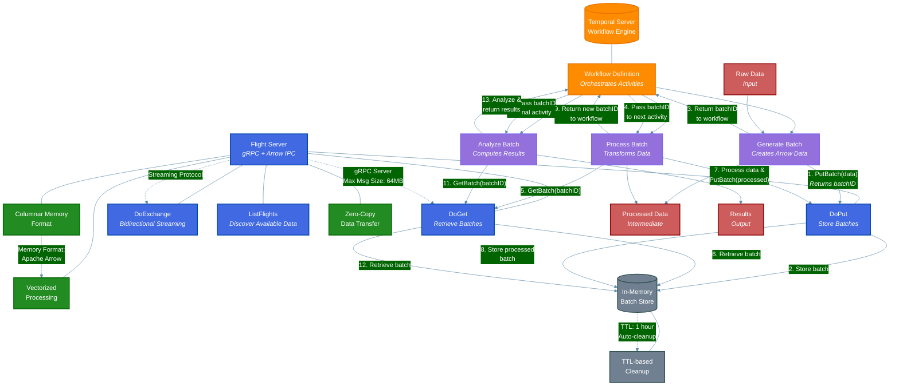

# Temporal + Arrow Flight Architecture Diagrams

This document contains the technical diagrams for the Temporal + Arrow Flight integration pattern.

## System Architecture

The system architecture diagram illustrates the high-level components of the system and their interactions, showing how Temporal orchestrates workflows while Arrow Flight handles data transfer.

### Key Components

- **Temporal Server & Workflow**: Orchestrates the entire process, managing activity execution, retries, and state.
- **Activity Workers**: Execute specific tasks in the data pipeline (Generate, Process, Analyze).
- **Flight Server**: Handles high-speed data transfer using Arrow's columnar format.
- **Flight APIs**: Provides methods for data retrieval (DoGet), storage (DoPut), and discovery (ListFlights).
- **Batch Store**: In-memory storage for Arrow Record Batches with TTL-based cleanup.
- **Data Flow**: Shows how data moves from raw input through processing to final results.

### Workflow Sequence

1. Generate Batch activity creates data and sends it to the Flight Server via DoPut
2. The batch is stored with a unique ID
3. The batch ID is returned to the workflow
4. The workflow passes the batch ID to the Process Batch activity
5. Process Batch retrieves the data via DoGet
6. After processing, it stores the result via DoPut and returns a new batch ID
7. The workflow passes the new batch ID to the Analyze Batch activity
8. Analyze Batch retrieves the data and computes the final results
9. Results are returned to the workflow

## Data Flow Comparison

This diagram compares traditional data pipelines with Arrow Flight pipelines, highlighting the efficiency gains from zero-copy transfers and columnar data format.

```mermaid
%%{init: {
  'theme': 'base',
  'themeVariables': {
    'primaryColor': '#4682B4',
    'primaryTextColor': '#fff',
    'primaryBorderColor': '#2E5984',
    'lineColor': '#4682B4',
    'secondaryColor': '#6B8E23',
    'tertiaryColor': '#fff'
  }
}}%%

flowchart LR
    classDef memory fill:#8A2BE2,stroke:#4B0082,stroke-width:2px,color:white
    classDef process fill:#2E8B57,stroke:#006400,stroke-width:2px,color:white
    classDef data fill:#CD5C5C,stroke:#8B0000,stroke-width:2px,color:white
    classDef network fill:#4169E1,stroke:#0047AB,stroke-width:2px,color:white
    classDef compare fill:#DAA520,stroke:#B8860B,stroke-width:2px,color:white
    
    %% Traditional Pipeline
    T_Data1["JSON/Protobuf<br/>Source Data"]:::data
    T_Ser["Serialize"]:::process
    T_Net["Network Transfer<br/><i>Serialized Bytes</i>"]:::network
    T_Deser["Deserialize"]:::process
    T_Proc["Process<br/><i>Row by Row</i>"]:::process
    T_Ser2["Serialize"]:::process
    T_Net2["Network Transfer<br/><i>Serialized Bytes</i>"]:::network
    T_Deser2["Deserialize"]:::process
    T_Data2["JSON/Protobuf<br/>Result Data"]:::data
    
    T_Data1 --> T_Ser
    T_Ser --> T_Net
    T_Net --> T_Deser
    T_Deser --> T_Proc
    T_Proc --> T_Ser2
    T_Ser2 --> T_Net2
    T_Net2 --> T_Deser2
    T_Deser2 --> T_Data2
    
    %% Memory overhead annotations
    T_Ser -. "Memory Copy #1" .-> T_Net
    T_Deser -. "Memory Copy #2" .-> T_Proc
    T_Ser2 -. "Memory Copy #3" .-> T_Net2
    T_Deser2 -. "Memory Copy #4" .-> T_Data2
    
    %% Arrow Flight Pipeline
    A_Data1["Arrow Record Batch<br/><i>Columnar Format</i>"]:::data
    A_Flight1["Flight DoPut<br/><i>Zero-Copy Transfer</i>"]:::network
    A_Store["Flight Server<br/><i>In-Memory Storage</i>"]:::memory
    A_Flight2["Flight DoGet<br/><i>Zero-Copy Transfer</i>"]:::network
    A_Proc["Vectorized Processing<br/><i>SIMD Operations</i>"]:::process
    A_Flight3["Flight DoPut<br/><i>Zero-Copy Transfer</i>"]:::network
    A_Store2["Flight Server<br/><i>In-Memory Storage</i>"]:::memory
    A_Flight4["Flight DoGet<br/><i>Zero-Copy Transfer</i>"]:::network
    A_Data2["Arrow Record Batch<br/><i>Result Data</i>"]:::data
    
    A_Data1 --> A_Flight1
    A_Flight1 --> A_Store
    A_Store --> A_Flight2
    A_Flight2 --> A_Proc
    A_Proc --> A_Flight3
    A_Flight3 --> A_Store2
    A_Store2 --> A_Flight4
    A_Flight4 --> A_Data2
    
    %% Memory efficiency annotations
    A_Data1 -. "Columnar Format<br/>Memory Efficient" .-> A_Flight1
    A_Flight2 -. "Direct Memory Access<br/>No Deserialization" .-> A_Proc
    A_Proc -. "Operates on Columns<br/>Cache Efficient" .-> A_Flight3
    
    %% Memory Management Details
    M1["Arrow Memory Pool"]:::memory
    M2["Go Allocator"]:::memory
    M3["Zero-Copy Slices"]:::memory
    M4["Reference Counting"]:::memory
    
    M1 --- M2
    M1 --- M3
    M1 --- M4
    
    M3 -. "Avoid Redundant Copies" .-> M4
    M4 -. "Automatic Cleanup<br/>When No Longer Needed" .-> M1
    
    %% Performance Comparison
    P1["10K Records:<br/>Traditional: 250ms<br/>Arrow Flight: 50ms"]:::compare
    P2["100K Records:<br/>Traditional: 2.5s<br/>Arrow Flight: 0.3s"]:::compare
    P3["1M Records:<br/>Traditional: 25s<br/>Arrow Flight: 2.5s"]:::compare
    
    P1 --- P2 --- P3
    
    %% Connections between main sections
    T_Data2 -. "vs" .-> P1
    A_Data2 -. "vs" .-> P1
    A_Store --- M1
    
    %% Technical details for Arrow implementation
    A_Data1 -. "Schema-aware<br/>Strongly Typed" .-> A_Flight1
    A_Proc -. "Batch Processing<br/>Vectorized Operations" .-> A_Flight3
    A_Store -. "TTL-based Cleanup<br/>Efficient Memory Usage" .-> A_Flight2
```

### Key Differences

#### Traditional Pipeline

- Multiple serialization/deserialization steps
- Four memory copies during data transfer
- Row-by-row processing
- Increasing overhead as data size grows

#### Arrow Flight Pipeline

- Zero-copy data transfer
- Columnar format for memory efficiency
- Vectorized processing with SIMD operations
- Direct memory access without deserialization

### Memory Management

- Arrow Memory Pool manages allocations efficiently
- Reference counting ensures deterministic cleanup
- Zero-copy slices avoid redundant copies
- Automatic cleanup when data is no longer needed

## Implementation Details

This class diagram shows the technical implementation of the Flight server and client components, including their methods, properties, and relationships.

```mermaid
%%{init: {
  'theme': 'base',
  'themeVariables': {
    'primaryColor': '#1E90FF',
    'primaryTextColor': '#fff',
    'primaryBorderColor': '#0000CD',
    'lineColor': '#1E90FF',
    'secondaryColor': '#32CD32',
    'tertiaryColor': '#fff'
  }
}}%%

classDiagram
    %% Flight Server Implementation
    class FlightServer {
        -addr string
        -server *grpc.Server
        -listener net.Listener
        -allocator memory.Allocator
        -batches map[string]arrow.Record
        -batchesMu sync.RWMutex
        -ttl time.Duration
        +NewFlightServer(config FlightServerConfig) *FlightServer
        +Start() error
        +Stop() error
        +DoGet(request *flight.Ticket, stream flight.FlightService_DoGetServer) error
        +DoPut(stream flight.FlightService_DoPutServer) error
        +ListFlights(criteria *flight.Criteria, stream flight.FlightService_ListFlightsServer) error
        +GetFlightInfo(descriptor *flight.FlightDescriptor, request flight.FlightService_GetFlightInfoServer) error
        +DoAction(action *flight.Action, stream flight.FlightService_DoActionServer) error
        -cleanupExpiredBatches()
    }
    
    class FlightServerConfig {
        +Addr string
        +Allocator memory.Allocator
        +TTL time.Duration
    }
    
    %% Flight Client Implementation
    class FlightClient {
        -client flight.Client
        -addr string
        -allocator memory.Allocator
        +NewFlightClient(config FlightClientConfig) *FlightClient
        +Close() error
        +PutBatch(ctx context.Context, batch arrow.Record) (string, error)
        +GetBatch(ctx context.Context, batchID string) (arrow.Record, error)
        +ListBatches(ctx context.Context) ([]string, error)
    }
    
    class FlightClientConfig {
        +Addr string
        +Allocator memory.Allocator
    }
    
    %% Arrow Utilities
    class ArrowSerializer {
        -pool memory.Allocator
        +NewSerializer(pool memory.Allocator) *Serializer
        +SerializeRecord(record arrow.Record) ([]byte, error)
        +DeserializeRecord(data []byte) (arrow.Record, error)
        +SerializeTable(table arrow.Table) ([]byte, error)
        +DeserializeTable(data []byte) (arrow.Table, error)
    }
    
    %% Temporal Integration
    class FlightWorkflow {
        +Execute(ctx workflow.Context, input WorkflowInput) (WorkflowResult, error)
        -generateBatchActivity(ctx workflow.Context, input ActivityInput) (string, error)
        -processBatchActivity(ctx workflow.Context, batchID string) (string, error)
        -analyzeBatchActivity(ctx workflow.Context, batchID string) (AnalysisResult, error)
    }
    
    class FlightActivities {
        -flightClient *FlightClient
        +NewFlightActivities(client *FlightClient) *FlightActivities
        +GenerateBatch(ctx context.Context, input ActivityInput) (string, error)
        +ProcessBatch(ctx context.Context, batchID string) (string, error)
        +AnalyzeBatch(ctx context.Context, batchID string) (AnalysisResult, error)
    }
    
    %% Relationships
    FlightServer --> FlightServerConfig : configured by
    FlightClient --> FlightClientConfig : configured by
    FlightActivities --> FlightClient : uses
    FlightWorkflow --> FlightActivities : invokes
    
    %% Implementation Details
    class DoGetImplementation {
        <<interface>>
        Validate ticket and extract batchID
        Retrieve batch from in-memory store
        Create RecordWriter with batch schema
        Write batch to stream
        Close writer to signal completion
    }
    
    class DoPutImplementation {
        <<interface>>
        Receive first message with FlightDescriptor
        Create RecordReader from stream
        Read batch from stream
        Generate unique batchID
        Store batch with TTL
        Send batchID back to client
    }
    
    class PutBatchImplementation {
        <<interface>>
        Create FlightDescriptor
        Start DoPut stream
        Send descriptor as first message
        Create RecordWriter with batch schema
        Write batch to stream
        Close writer and receive response
        Extract and return batchID
    }
    
    class GetBatchImplementation {
        <<interface>>
        Create context with timeout
        Create Flight ticket with batchID
        Start DoGet stream
        Create RecordReader from stream
        Read batch from stream
        Retain batch to prevent release
        Return batch to caller
    }
    
    FlightServer --|> DoGetImplementation : implements
    FlightServer --|> DoPutImplementation : implements
    FlightClient --|> PutBatchImplementation : implements
    FlightClient --|> GetBatchImplementation : implements
    
    %% Technical Notes
    class TechnicalNotes {
        <<note>>
        Zero-copy transfers use Arrow IPC format
        gRPC streaming for efficient data movement
        Reference counting manages memory lifecycle
        TTL-based cleanup prevents memory leaks
        Timeouts prevent deadlocks in client operations
    }
    
    %% Error Handling
    class ErrorHandling {
        <<note>>
        Context timeouts prevent hanging operations
        Proper cleanup on error conditions
        Graceful handling of network failures
        Detailed error messages for debugging
        Resource cleanup with defer statements
    }
    
    FlightServer --> TechnicalNotes : follows
    FlightClient --> TechnicalNotes : follows
    FlightServer --> ErrorHandling : implements
    FlightClient --> ErrorHandling : implements
```

### Key Components

#### Server-Side

- **FlightServer**: Implements the Arrow Flight protocol server
  - Manages in-memory batch storage with TTL-based cleanup
  - Handles DoGet and DoPut operations for data transfer
  - Provides batch listing and discovery capabilities

#### Client-Side

- **FlightClient**: Provides a high-level API for interacting with the Flight server
  - Simplifies batch storage and retrieval operations
  - Handles connection management and cleanup
  - Implements timeouts to prevent deadlocks

#### Temporal Integration

- **FlightWorkflow**: Defines the workflow that orchestrates data processing
  - Manages activity execution and data flow
  - Passes batch IDs between activities

- **FlightActivities**: Implements the activities that interact with the Flight server
  - Generates, processes, and analyzes data batches
  - Uses the FlightClient to store and retrieve data

### Implementation Details

- **DoGet/DoPut**: Core Flight protocol operations for data transfer
- **Zero-Copy Transfers**: Uses Arrow IPC format for efficient data movement
- **Error Handling**: Implements timeouts, proper cleanup, and detailed error messages
- **Memory Management**: Uses reference counting and TTL-based cleanup to prevent leaks
